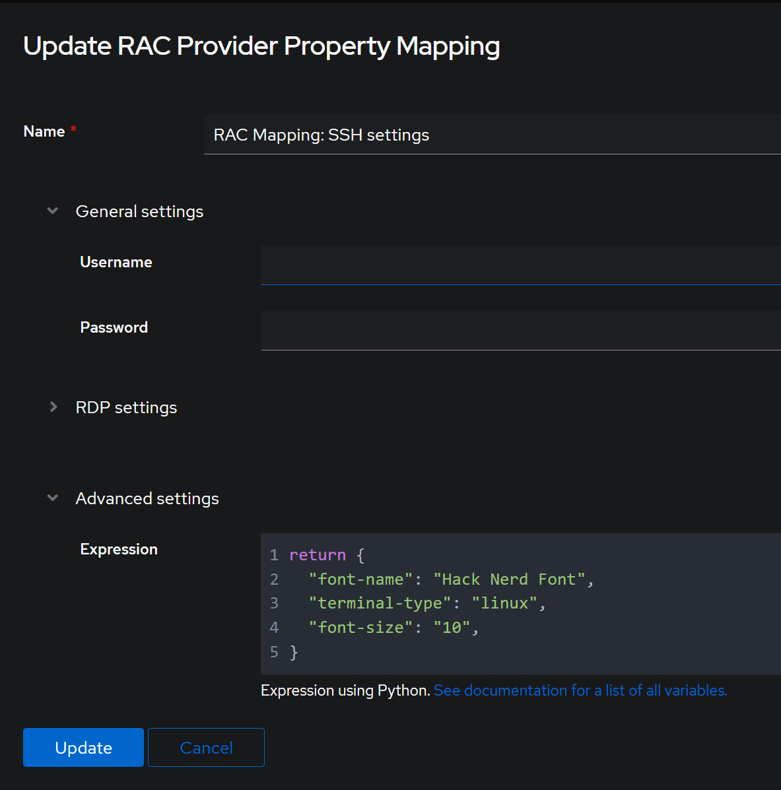

# Patch Authentik Remote Access Control (RAC) outpost

<https://docs.goauthentik.io/add-secure-apps/providers/rac/>

```yaml
deployment:
  - op: add
    path: /spec/template/spec/initContainers
    value:
      - name: copy-fonts
        image: ghcr.io/michael-grosshaeuser/rac_font_init:1.0.0
        volumeMounts:
          - name: hack-fonts
            mountPath: /font_volume
            readOnly: false
        securityContext:
          privileged: false
          runAsNonRoot: false
          readOnlyRootFilesystem: true
          allowPrivilegeEscalation: false
          seccompProfile:
            type: RuntimeDefault
        resources:
          requests:
            memory: "32Mi"
            cpu: "50m"
          limits:
            memory: "64Mi"
            cpu: "50m"
  - op: add
    path: /spec/template/spec/containers/0/volumeMounts
    value:
      - name: hack-fonts
        subPath: HackNerdFont-Regular.ttf
        readOnly: true
        mountPath: /usr/share/fonts/truetype/HackNerdFont-Regular.ttf
  - op: add
    path: /spec/template/spec/volumes
    value:
      - name: hack-fonts
        emptyDir: {}
```

Check installed font in outpost container:

```bash
fc-list | grep Nerd
/usr/share/fonts/truetype/HackNerdFont-Regular.ttf: Hack Nerd Font:style=Regular
```

## Configure SSH connection

Update the SSH connection’s property mapping to use the new font.

```json
return {
  "font-name": "Hack Nerd Font",
  "terminal-type": "linux",
  "font-size": "10",
}
```

Example for the Remote Access Control Provider Property Mapping:

